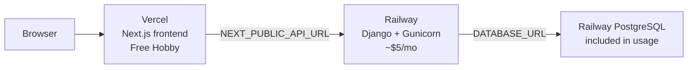
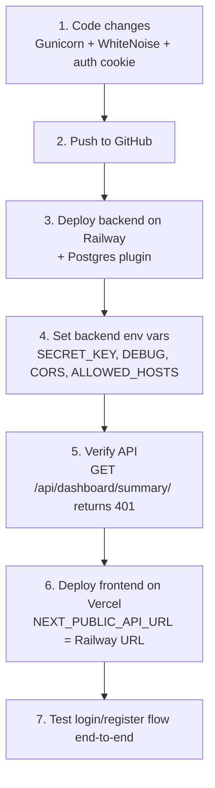

# Budget-Friendly Deployment Plan

## Architecture



| Layer | Platform | Est. cost |
|-------|----------|-----------|
| Frontend | [Vercel](https://vercel.com) Hobby | **$0** |
| Backend API | [Railway](https://railway.com) Hobby | **~$5/mo** (includes $5 usage credit) |
| Database | Railway PostgreSQL plugin | **Included** in Railway usage |

**Why Railway for ~$5 managed:** Render always-on web ($7) + Postgres ($7) exceeds budget. Railway Hobby bundles app + DB in one dashboard with GitHub auto-deploy — minimal DevOps. A lean Django REST API with no workers, file storage, or Redis typically stays within the $5 credit.

**Fallback if Railway usage creeps over $5:** Move DB to [Neon](https://neon.tech) free tier (0.5 GB) and keep Railway for compute only — still managed, still ~$5.

---

## What the codebase needs first (backend production hardening)

The backend is MVP-ready functionally but uses Django's **dev server** in production. These changes are required before deploy:

### 1. Add Gunicorn — [`backend/requirements.txt`](D:\TechThrive\Projects\techthrive-hub\backend\requirements.txt)

```
gunicorn>=22.0,<23
whitenoise>=6.7,<7
```

- **Gunicorn** — production WSGI server (replaces `runserver`)
- **WhiteNoise** — serves Django admin static files without a separate CDN (free, zero extra service)

### 2. Update Dockerfile CMD — [`backend/Dockerfile`](D:\TechThrive\Projects\techthrive-hub\backend\Dockerfile)

Change from:
```dockerfile
CMD ["python", "manage.py", "runserver", "0.0.0.0:8000"]
```
To:
```dockerfile
CMD ["gunicorn", "config.wsgi:application", "--bind", "0.0.0.0:8000", "--workers", "2", "--timeout", "60"]
```

`entrypoint.sh` already runs migrations on boot — keep that.

### 3. Production settings — [`backend/config/settings.py`](D:\TechThrive\Projects\techthrive-hub\backend\config\settings.py)

Add WhiteNoise middleware (after `SecurityMiddleware`):
```python
MIDDLEWARE = [
    "django.middleware.security.SecurityMiddleware",
    "whitenoise.middleware.WhiteNoiseMiddleware",
    ...
]
STATIC_ROOT = BASE_DIR / "staticfiles"
```

Add production security when `DEBUG=False` (Railway sets this via env):
```python
if not DEBUG:
    SECURE_PROXY_SSL_HEADER = ("HTTP_X_FORWARDED_PROTO", "https")
    SESSION_COOKIE_SECURE = True
    CSRF_COOKIE_SECURE = True
```

### 4. Small frontend fix for HTTPS — [`frontend/lib/auth.ts`](D:\TechThrive\Projects\techthrive-hub\frontend\lib\auth.ts)

Middleware reads the `access_token` cookie for route protection. On HTTPS production, add `Secure` flag:
```typescript
const secure = typeof window !== "undefined" && window.location.protocol === "https:";
document.cookie = `access_token=${access}; path=/; max-age=3600; SameSite=Lax${secure ? "; Secure" : ""}`;
```

---

## Frontend: Vercel deployment

### Vercel project settings

| Setting | Value |
|---------|-------|
| Root Directory | `frontend` |
| Framework | Next.js (auto-detected) |
| Build Command | `npm run build` |
| Install Command | `npm install` |

### Environment variable

| Variable | Value |
|----------|-------|
| `NEXT_PUBLIC_API_URL` | `https://<your-railway-backend-domain>` (no trailing slash) |

Set this **before** the first production build — `NEXT_PUBLIC_*` is baked in at build time.

### Deploy steps

1. Push repo to GitHub (if not already)
2. Import project in Vercel → select `frontend` as root
3. Add `NEXT_PUBLIC_API_URL` env var (use Railway URL after backend is live, then redeploy)
4. Deploy — Vercel runs middleware on Edge automatically; no `vercel.json` needed

---

## Backend: Railway deployment

### Railway project setup

1. Create Railway account → subscribe to **Hobby plan** ($5/mo)
2. New Project → **Deploy from GitHub repo**
3. Add **PostgreSQL** service (one click) — Railway injects `DATABASE_URL` automatically
4. Add **backend** service:
   - Source: same repo, root path `/backend`
   - Builder: **Dockerfile** (uses existing [`backend/Dockerfile`](D:\TechThrive\Projects\techthrive-hub\backend\Dockerfile))
   - Link `DATABASE_URL` from Postgres service to backend service variables

### Backend environment variables

| Variable | Production value | Notes |
|----------|------------------|-------|
| `SECRET_KEY` | Random 50+ char string | Generate: `python -c "from django.core.management.utils import get_random_secret_key; print(get_random_secret_key())"` |
| `DEBUG` | `False` | Required for security |
| `ALLOWED_HOSTS` | `your-app.up.railway.app` | Railway provides domain; add custom domain later if needed |
| `ALLOW_REGISTRATION` | `True` or `False` | Your choice for prod |
| `DATABASE_URL` | Auto from Postgres plugin | Do not set manually |
| `CORS_ALLOWED_ORIGINS` | `https://your-app.vercel.app` | Your Vercel URL; comma-separate if you have preview domains |

### Networking

- Railway auto-assigns a public HTTPS URL (e.g. `https://techthrive-api-production.up.railway.app`)
- Copy this URL → set as `NEXT_PUBLIC_API_URL` in Vercel → redeploy frontend
- No reverse proxy needed — frontend calls backend directly from the browser (already how [`frontend/lib/api.ts`](D:\TechThrive\Projects\techthrive-hub\frontend\lib\api.ts) works)

### Post-deploy: create admin user

Railway provides a shell/CLI. Run once:
```bash
python manage.py createsuperuser
```
Needed for Django admin at `/admin/`.

---

## Deployment order (important)



Deploy **backend first**, then frontend — frontend needs the live API URL at build time.

---

## Environment variable cheat sheet

| Service | Variable | Example |
|---------|----------|---------|
| Railway (backend) | `SECRET_KEY` | `django-secret-...` |
| Railway (backend) | `DEBUG` | `False` |
| Railway (backend) | `ALLOWED_HOSTS` | `techthrive-api.up.railway.app` |
| Railway (backend) | `CORS_ALLOWED_ORIGINS` | `https://techthrive.vercel.app` |
| Railway (backend) | `DATABASE_URL` | `postgres://...` (auto) |
| Vercel (frontend) | `NEXT_PUBLIC_API_URL` | `https://techthrive-api.up.railway.app` |

---

## Cost control tips

- **Stay on Railway Hobby** — monitor usage in Railway dashboard; small Django + Postgres usually fits $5 credit
- **No extra services needed** — no Redis, Celery, S3, or email provider in current codebase
- **Vercel preview deploys** — if you use preview URLs, add each to `CORS_ALLOWED_ORIGINS` or use a wildcard pattern (not recommended for prod; stick to production Vercel URL for now)
- **Upgrade trigger** — if cold starts or usage exceed credit, consider Neon free DB + Railway compute split (~$3–5 compute only)

---

## Verification checklist

- [ ] `https://<railway-url>/admin/` loads (static files via WhiteNoise)
- [ ] `POST https://<railway-url>/api/auth/register/` works from Vercel origin (CORS)
- [ ] Login on Vercel → dashboard loads projects/kanban
- [ ] JWT refresh works (401 → auto-refresh in `api.ts`)
- [ ] `DEBUG=False` — no stack traces leaked on errors
- [ ] `createsuperuser` run for admin access

---

## Optional later (not needed for MVP)

- Custom domain on Vercel + Railway (free on both platforms)
- GitHub Actions CI (lint/test before deploy)
- `railway.toml` or `render.yaml` in repo for reproducible infra-as-code
- Sentry free tier for error monitoring
- YouTube/Google OAuth (per existing plan doc) — adds external API keys, not infra cost
